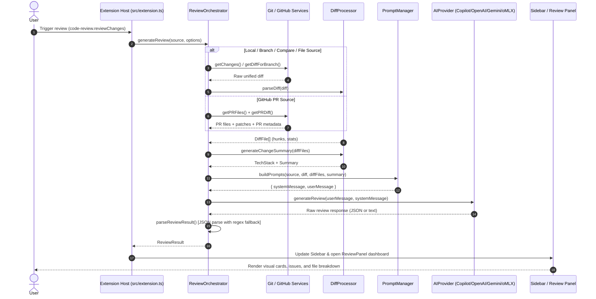

# Architecture Specification

## 1. System Overview

`Code Review AI` is a VS Code extension that automates source code reviews across local and remote git contexts. It bridges the developer's workspace with LLM backends (GitHub Copilot, OpenAI, Google Gemini, and local oMLX servers) to provide actionable, line-level feedback regarding correctness, security vulnerabilities, performance regressions, test coverage, and framework best practices.

```mermaid
graph TD
    subgraph VS Code Host
        EXT[Extension Core / src/extension.ts]
        CHAT[Chat Participant @code-review]
        CMDS[Commands & QuickPicks]
    end

    subgraph Webview Layer
        SIDEBAR[Sidebar Provider / src/webview/sidebarProvider.ts]
        PRPANEL[PR Selection Panel / src/webview/prSelectionPanel.ts]
        DASHBOARD[Review Panel Dashboard / src/webview/reviewPanel.ts]
    end

    subgraph Orchestration & Domain Services
        ORCH[Review Orchestrator / src/services/reviewOrchestrator.ts]
        DIFF[Diff Processor / src/services/diffProcessor.ts]
        PROMPT[Prompt Manager / src/services/promptManager.ts]
        KSTORE[Knowledge Store / src/services/knowledgeStore.ts]
        GIT[Git Service / src/services/git.ts]
        GH[GitHub Service / src/services/githubService.ts]
        TOKEN[GitHub Token Manager / src/services/githubTokenManager.ts]
    end

    subgraph AI Providers
        PROV_ANTIGRAVITY[Antigravity Provider / vscode.lm & Endpoints]
        PROV_COPILOT[Copilot Provider / vscode.lm]
        PROV_OPENAI[OpenAI Provider / gpt-4o]
        PROV_GEMINI[Gemini Provider / gemini-1.5-flash/pro]
        PROV_OMLX[oMLX Provider / local MLX]
    end

    EXT --> SIDEBAR
    EXT --> PRPANEL
    EXT --> CHAT
    EXT --> CMDS
    CMDS --> ORCH
    SIDEBAR --> ORCH
    CHAT --> ORCH
    
    ORCH --> GIT
    ORCH --> GH
    ORCH --> TOKEN
    ORCH --> DIFF
    ORCH --> PROMPT
    ORCH --> KSTORE
    ORCH --> PROV_ANTIGRAVITY
    ORCH --> PROV_COPILOT
    ORCH --> PROV_OPENAI
    ORCH --> PROV_GEMINI
    ORCH --> PROV_OMLX
    
    ORCH --> DASHBOARD
    ORCH --> SIDEBAR
```



---

## 2. Architectural Layers

### 2.1 Extension Activation & Command Infrastructure
- **Module**: [`src/extension.ts`](../src/extension.ts)
- **Role**:
  - Initializes error handling listeners (`uncaughtException`, `unhandledRejection`) directed to a dedicated `Code Review` output channel.
  - Registers custom WebviewView providers for the Activity Bar explorer container (`code-review-explorer`).
  - Registers user commands:
    - `code-review.selectSource`: QuickPick interface for source selection (Local, Branch, PR, Compare, Active File).
    - `code-review.setSource`: IPC bridge from webviews to change current review source.
    - `code-review.reviewChanges`: Main orchestrator execution trigger with status bar / notification progress indicators.
  - Registers the VS Code Chat Participant (`code-review.agent`) enabling natural language prompt triggers like `@code-review #42`.

---

### 2.2 Orchestration Pipeline
- **Module**: [`src/services/reviewOrchestrator.ts`](../src/services/reviewOrchestrator.ts)
- **Role**:
  Coordinates the review lifecycle from input extraction to display.



---

### 2.3 AI Provider Layer
- **Interface**: [`AIProvider`](../src/providers/types.ts)
  ```typescript
  export interface AIProvider {
    generateReview(userMessage: string, systemMessage?: string): Promise<string>;
  }
  ```
- **Implementations**:
  1. **Google Antigravity** ([`src/providers/antigravity.ts`](../src/providers/antigravity.ts)):
     - Supports native in-editor Language Model Chat API (`vscode.lm`) with selection priority: preference family -> `vendor: 'antigravity'` -> `vendor: 'google'` -> `family: 'gemini'` -> any available model.
     - Supports optional custom HTTP OpenAI-compatible endpoint fallback for local sidecars.
  2. **GitHub Copilot** ([`src/providers/copilot.ts`](../src/providers/copilot.ts)):
     - Uses `vscode.lm.selectChatModels` with preference ordering: GPT-4o (`vendor: 'github', family: 'gpt-4o'`) -> Any GitHub model -> Any chat model.
     - Sends `LanguageModelChatMessage.User` with unified prompt.
     - Asynchronously consumes `response.text` streams.
  3. **OpenAI** ([`src/providers/openai.ts`](../src/providers/openai.ts)):
     - Communicates with OpenAI API using official `openai` SDK (`gpt-4o`).
  4. **Google Gemini** ([`src/providers/gemini.ts`](../src/providers/gemini.ts)):
     - Uses `@google/generative-ai` SDK with fallback cascade: `gemini-1.5-flash-latest` -> `gemini-1.5-flash` -> `gemini-1.5-pro-latest` -> `gemini-pro`.
     - Automatically truncates payloads exceeding 150,000 characters to ensure safe token compliance.
  5. **oMLX** ([`src/providers/omlx.ts`](../src/providers/omlx.ts)):
     - Uses OpenAI SDK client targeted at local/custom HTTP base URLs (e.g. `http://127.0.0.1:8197/v1`) with local models (e.g., `Qwen3-1.7B-MLX-4bit` or `llama3`).

---

### 2.4 Diff Analysis and Heuristic Services
- **Module**: [`src/services/diffProcessor.ts`](../src/services/diffProcessor.ts)
- **Role**:
  - **Unified Diff Parser**: Parses raw git diff chunks (`diff --git`, `@@ -oldStart,oldCount +newStart,newCount @@`, added/deleted lines) into structured `DiffFile` and `DiffHunk` records.
  - **Tech Stack Detection**: Inspects file extensions and directory paths to detect languages (TypeScript, Python, Go, Rust, Java, etc.), frameworks (React, Vue, Angular, Next, Django, FastAPI, Spring), and tools (Docker, Make, GitHub Actions, npm/yarn).
  - **Importance Weighting**: Assigns 0.0 to 1.0 importance weights based on file nature:
    - Critical configuration (`package.json`, `Cargo.toml`, `go.mod`): 0.90 - 0.95
    - Build/tool config (`tsconfig.json`, `Dockerfile`): 0.85
    - Core entry points (`src/index`, `src/app`, `src/server`): 0.80
    - Test files (`.test.`, `__tests__`): 0.60
    - Documentation (`README`, `.md`): 0.35 - 0.40
    - Git config/formatters: 0.20
  - **Token Budget Filter**: `selectImportantFiles` trims low-priority files when the diff exceeds maximum file count or estimated token ceilings.

---

### 2.5 Prompt Engineering and Domain Knowledge
- **System Instructions**: [`src/constants/reviewInstructions.ts`](../src/constants/reviewInstructions.ts)
  - Establishes persona as Senior Software Engineer & Security Auditor.
  - Dictates context building, balanced critique (praising strengths), and category checklists (Functionality, Testing, Code Quality, Documentation, Performance & Accessibility, Security).
  - Demands strict raw JSON conforming to the verdict schema without markdown codeblocks.
- **Prompt Generator**: [`src/services/promptManager.ts`](../src/services/promptManager.ts)
  - Combines instructions with tech stack context, file change statistics, and calculated risk level (Low, Medium, High).
  - Assembles PR metadata (title, author, description, linked issue requirements) and line-numbered diff content for the user message.
- **Workspace Knowledge**: [`src/services/knowledgeStore.ts`](../src/services/knowledgeStore.ts)
  - Loads workspace-level `knowledge.md` rules.
  - Discovers adjacent documentation and source context for active file reviews within a 1,000-token threshold.

---

### 2.6 Git and GitHub Integrations
- **Local Git**: [`src/services/git.ts`](../src/services/git.ts)
  - Executes git commands via Node's `child_process.spawn`.
  - Automatically filters noise (`package-lock.json`, `yarn.lock`, `pnpm-lock.yaml`, `*.map`, `*.min.js`, `dist/*`, `out/*`, `build/*`).
  - Implements a hard buffer cap of 200KB (`MAX_AI_DIFF_SIZE`) with truncation markers.
- **GitHub REST API**: [`src/services/githubService.ts`](../src/services/githubService.ts)
  - Communicates with `https://api.github.com` via Axios instance.
  - Inspects `x-ratelimit-remaining` and `x-ratelimit-reset` headers on each response.
  - Implements exponential backoff retry for HTTP 429 and 5xx errors.
  - Fetches PR details, raw diffs (`Accept: application/vnd.github.v3.diff`), file patch lists, and regex-extracted linked issues from PR bodies and branch names.
- **Token Security**: [`src/services/githubTokenManager.ts`](../src/services/githubTokenManager.ts)
  - Stores tokens securely using `vscode.SecretStorage` (`github.token`).
  - Supports fallback to workspace configuration `code-review.githubToken`.
  - Validates tokens against GitHub's `/user` endpoint before running authenticated queries.

---

### 2.7 Webview User Interface Subsystem
- **Sidebar View**: [`src/webview/sidebarProvider.ts`](../src/webview/sidebarProvider.ts)
  - Registered as `code-review-sidebar`.
  - Displays selected source, review trigger button with animated loading state, verdict banner, summary preview, and colored severity counters (Critical, High, Medium, Low).
- **PR Selection View**: [`src/webview/prSelectionPanel.ts`](../src/webview/prSelectionPanel.ts)
  - Registered as `code-review-pr-selection`.
  - Offers three interactive modes: Current Branch, Specific PR (with auto-fetched open PR list and 5-minute memory cache), and Compare Branches.
- **Full Review Dashboard**: [`src/webview/reviewPanel.ts`](../src/webview/reviewPanel.ts)
  - Created as an editor panel via `vscode.window.createWebviewPanel`.
  - Renders a gradient hero banner with overall verdict, overview section, responsive grid of issue cards with severity badges, and per-file breakdowns.
  - Interactive navigation: Clicking on any issue card or file location sends an `openFile` IPC message that automatically opens the document and positions the cursor at the offending line.

---

## 3. Data Contracts and Schemas

```typescript
// Review Source definition
export type ReviewSourceType = 'branch' | 'pr' | 'compare' | 'file' | 'local';

export interface ReviewSource {
  type: ReviewSourceType;
  branch?: string;
  prNumber?: number;
  repo?: string;
  baseBranch?: string;
  headBranch?: string;
  filePath?: string;
}

// AI Review Output
export interface ReviewResult {
  verdict: 'approved' | 'approved-with-comments' | 'changes-requested';
  summary: string;
  issues: ReviewIssue[];
  fileBreakdown: FileReview[];
}

export interface ReviewIssue {
  severity: 'critical' | 'high' | 'medium' | 'low';
  title: string;
  description: string;
  file?: string;
  line?: number;
  snippet?: string;
}

export interface FileReview {
  filename: string;
  status: 'added' | 'modified' | 'deleted';
  summary?: string;
  snippet?: string;
}
```

---

## 4. Error Handling and Resilience

1. **AI Output Resiliency**:
   - If the AI returns markdown or free-form text instead of valid JSON, `ReviewOrchestrator.parseReviewResult` uses `jsonMatch = review.match(/\{[\s\S]*\}/)`.
   - If JSON parsing fails completely, `parseReviewText` evaluates keywords (`approved`, `changes requested`) and severity patterns to construct a fallback `ReviewResult`.
2. **Rate Limit Resilience**:
   - `GitHubService` sleeps and retries up to 3 times according to `retry-after` headers on HTTP 429, and applies exponential backoff on HTTP 5xx responses.
3. **Payload Truncation**:
   - Diffs are capped at 200KB in `GitService`.
   - Gemini payloads are capped at 150,000 characters.
   - Knowledge snippets are capped at 1,000 tokens.

---

## 5. Security Architecture

- **Token Storage**: GitHub Personal Access Tokens are persisted via VS Code's encrypted `SecretStorage` API rather than plaintext settings files.
- **Webview Isolation**: All webview instances specify `localResourceRoots: [extensionUri]` to prevent arbitrary local filesystem read access.
- **XSS Prevention**: Dynamic HTML injected into webviews passes through `escapeHtml()` sanitization.
