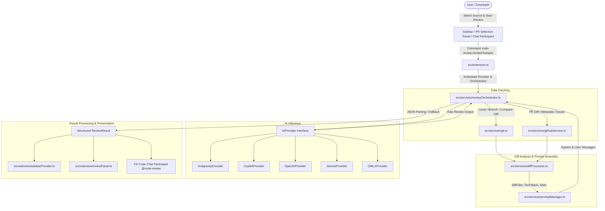

# AGENTS.md

## Repository Overview

`code-review` (Code Review AI) is a Visual Studio Code extension (version 0.0.2) that performs automated, AI-assisted code reviews. It analyzes git diffs across local uncommitted changes, branches, pull requests, branch comparisons, and active files for functional bugs, performance regressions, test coverage gaps, and security vulnerabilities.

The extension integrates multiple Large Language Model (LLM) backends:
- **Google Antigravity** (via VS Code Language Model API `vscode.lm` or custom endpoints)
- **GitHub Copilot Chat** (via VS Code Language Model API `vscode.lm`)
- **Google Gemini** (via `@google/generative-ai` SDK)
- **OpenAI** (via `openai` SDK, default model `gpt-4o`)
- **oMLX** (Local LLM server via OpenAI-compatible endpoints)

---

## Core Technologies and Dependencies

- **Platform**: VS Code Extension API (`^1.90.0`)
- **Language**: TypeScript 4.9.5 targeting ES2020 / CommonJS (`tsconfig.json`)
- **HTTP / REST**: Axios (`^1.3.4`), Octokit REST (`^20.0.0`)
- **AI SDKs**: `@google/generative-ai` (`^0.24.1`), `openai` (`^4.0.0`), `vscode.lm`
- **Testing**: Mocha (`@types/mocha`, `@vscode/test-electron`)
- **Packaging**: `@vscode/vsce` (`.vsix` artifact generation)

---

## Essential Commands

```bash
# Install dependencies
npm install

# Compile TypeScript
npm run compile

# Watch mode for iterative development
npm run watch

# Run test suite
npm test

# Package into a VSIX extension
npx vsce package
```

---

## Project Structure

```
.
├── .agent/
│   └── context/
│       └── architecture.md            # In-depth architectural specification
├── media/                             # Webview styling and assets
│   ├── prSelection.css
│   ├── reset.css
│   └── vscode.css
├── src/
│   ├── constants/
│   │   └── reviewInstructions.ts      # Structured prompt instructions and JSON schema
│   ├── providers/                     # AI Model provider implementations
│   │   ├── antigravity.ts             # Google Antigravity provider (vscode.lm / endpoints)
│   │   ├── copilot.ts                 # GitHub Copilot via vscode.lm
│   │   ├── gemini.ts                  # Google Gemini API integration
│   │   ├── omlx.ts                    # Local MLX / OpenAI-compatible provider
│   │   ├── openai.ts                  # OpenAI API integration
│   │   └── types.ts                   # AIProvider interface
│   ├── services/                      # Business logic and domain services
│   │   ├── diffProcessor.ts           # Unified diff parser, tech stack detection, heuristics
│   │   ├── errorHandler.ts            # Error normalization and SafeError wrapping
│   │   ├── git.ts                     # Git CLI integration via child_process
│   │   ├── githubService.ts           # GitHub REST API client with retry and rate limiting
│   │   ├── githubTokenManager.ts      # SecretStorage and settings token manager
│   │   ├── knowledgeStore.ts          # Workspace knowledge indexing (knowledge.md)
│   │   ├── promptManager.ts           # Dynamic system/user prompt generator
│   │   └── reviewOrchestrator.ts      # End-to-end review lifecycle orchestrator
│   ├── test/                          # Unit and integration tests
│   │   └── diffProcessor.test.ts      # Diff parsing and tech stack detection test suite
│   ├── webview/                       # UI Providers and Webview panels
│   │   ├── prSelectionPanel.ts        # PR and branch selection sidebar webview
│   │   ├── reviewPanel.ts             # Full-screen code review dashboard panel
│   │   └── sidebarProvider.ts         # Main extension sidebar view provider
│   └── extension.ts                   # Extension entry point, command and agent registrations
├── package.json                       # Extension manifest, contributes, configurations
└── tsconfig.json                      # TypeScript compiler configuration
```

---

## System Architecture and Execution Flow



---

## Key Modules and Roles

| Module | Location | Responsibilities |
|---|---|---|
| Extension Entry | [`src/extension.ts`](./src/extension.ts) | Activation lifecycle, command registration, webview provider registration, Chat participant `@code-review`. |
| Review Orchestrator | [`src/services/reviewOrchestrator.ts`](./src/services/reviewOrchestrator.ts) | Coordinates diff fetching, prompt creation, LLM execution, and JSON review parsing. |
| AI Providers | [`src/providers/`](./src/providers/) | Implements [`AIProvider`](./src/providers/types.ts) for Antigravity ([`antigravity.ts`](./src/providers/antigravity.ts)), Copilot ([`copilot.ts`](./src/providers/copilot.ts)), Gemini ([`gemini.ts`](./src/providers/gemini.ts)), OpenAI ([`openai.ts`](./src/providers/openai.ts)), and oMLX ([`omlx.ts`](./src/providers/omlx.ts)). |
| Diff Processor | [`src/services/diffProcessor.ts`](./src/services/diffProcessor.ts) | Parses unified git diffs into files and hunks; calculates importance scores, detects tech stacks, and formats summaries. |
| Prompt Manager | [`src/services/promptManager.ts`](./src/services/promptManager.ts) | Assembles the system prompt ([`REVIEW_INSTRUCTIONS`](./src/constants/reviewInstructions.ts)) and user prompt with diffs, stats, and linked issues. |
| Git Service | [`src/services/git.ts`](./src/services/git.ts) | Interacts with local git repository using `child_process.spawn`. Enforces 200KB diff size limit and excludes lock/minified files. |
| GitHub Service | [`src/services/githubService.ts`](./src/services/githubService.ts) | Interacts with GitHub REST API via Axios. Implements exponential backoff, rate-limit header monitoring, and PR/issue fetching. |
| Token Manager | [`src/services/githubTokenManager.ts`](./src/services/githubTokenManager.ts) | Securely retrieves and persists GitHub Personal Access Tokens via `vscode.SecretStorage` and workspace settings. |
| Knowledge Store | [`src/services/knowledgeStore.ts`](./src/services/knowledgeStore.ts) | Reads workspace `knowledge.md` and extracts relevant snippets from nearby docs and markdown files. |
| UI Webviews | [`src/webview/`](./src/webview/) | Sidebar ([`sidebarProvider.ts`](./src/webview/sidebarProvider.ts)), PR Selection ([`prSelectionPanel.ts`](./src/webview/prSelectionPanel.ts)), and Full Dashboard ([`reviewPanel.ts`](./src/webview/reviewPanel.ts)). |

---

## AI Review Output Schema

All AI providers are instructed via [`src/constants/reviewInstructions.ts`](./src/constants/reviewInstructions.ts) to return raw JSON conforming to:

```typescript
export interface ReviewResult {
  verdict: 'approved' | 'approved-with-comments' | 'changes-requested';
  summary: string;
  issues: ReviewIssue[];
  fileBreakdown: FileReview[];
}

export interface ReviewIssue {
  severity: 'critical' | 'high' | 'medium' | 'low';
  title: string;
  description: string;
  file?: string;
  line?: number;
  snippet?: string;
}

export interface FileReview {
  filename: string;
  status: 'added' | 'modified' | 'deleted';
  summary?: string;
  snippet?: string;
}
```

If an LLM produces non-JSON output, [`ReviewOrchestrator`](./src/services/reviewOrchestrator.ts) includes a regex fallback parser (`parseReviewText`) to extract verdicts and severity findings gracefully.

---

## Coding Conventions & Guidelines for Agents

1. **TypeScript Standards**:
   - Strict typing is enforced via [`tsconfig.json`](./tsconfig.json). Avoid using `any` unless dealing with third-party error wrapping.
   - Use explicit return types for all public service methods.
2. **VS Code API Best Practices**:
   - Always push disposables to `context.subscriptions` or class-level `_disposables` arrays.
   - Guard against empty workspaces using `vscode.workspace.workspaceFolders`.
   - Use `vscode.SecretStorage` for credential storage rather than plaintext configuration when possible.
3. **Error Handling**:
   - Use [`extractErrorMessage`](./src/services/errorHandler.ts) or [`SafeError`](./src/services/errorHandler.ts) to prevent strict mode exceptions when reading error fields.
   - Always catch network and git errors and provide actionable user-facing messages.
4. **Token and Context Safety**:
   - Enforce diff length safety caps (`MAX_AI_DIFF_SIZE = 200KB`) in [`GitService`](./src/services/git.ts).
   - Filter lockfiles, sourcemaps, and build artifacts from diffs automatically.
5. **Webview Security**:
   - Set `localResourceRoots` strictly to `extensionUri`.
   - Sanitize and escape all HTML injections in webview HTML templates using helper functions like `escapeHtml`.

---

## Agent Roles & Workflows

When working in this repository, specialized subagents can be leveraged as follows:

- **Tech Lead** (`tech-lead`): Orchestrates requirements, keeps scopes small, delegates tasks, and verifies end-to-end integration.
- **Architectural Planner** (`architechtural-planner`): Designs interfaces, data flows, provider boundaries, and rollout plans before coding.
- **Backend Developer** (`backend-dev`): Implements LLM integrations, Git/GitHub services, API contracts, token management, and error handling.
- **Codebase Search** (`codebase-search`): Fast discovery of handlers, constants, types, and services across the codebase.
- **Coder** (`coder`): Implements concise, bug-free changes and webview UI updates.
- **Reviewer** (`reviewer`): Performs rigorous validation of diffs against correctness, security, performance, and testing standards.
